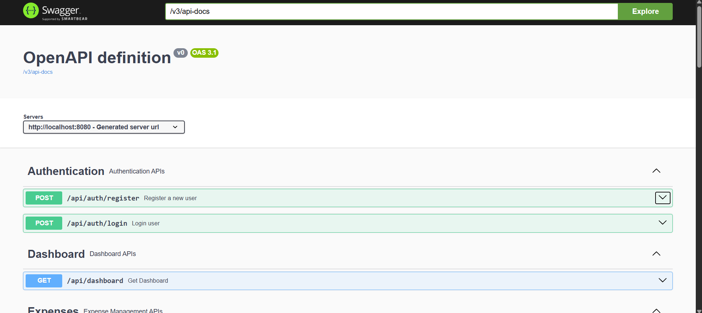
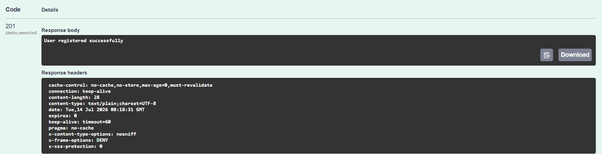
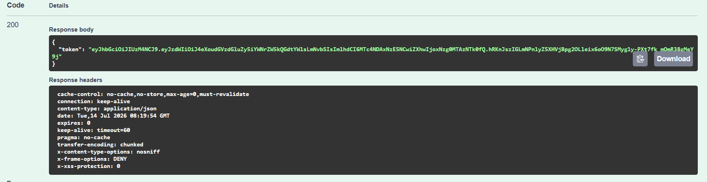
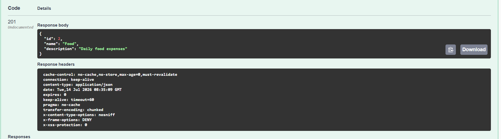
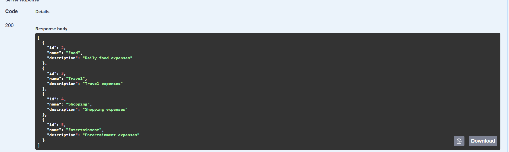
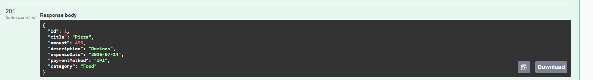
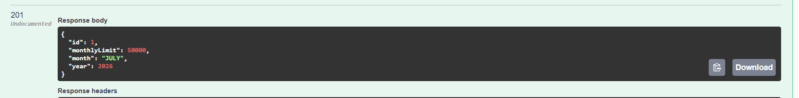

# 💰 Expense Tracker Backend

A production-style Expense Tracker REST API built using **Spring Boot** following a layered architecture with secure JWT authentication, Redis caching, Kafka event-driven messaging, scheduled recurring expenses, dynamic filtering, reporting, and Swagger documentation.

---

## 🚀 Features

### 👤 Authentication
- User Registration
- User Login
- JWT Authentication
- BCrypt Password Encryption
- Spring Security Integration
- Stateless Authentication

---

### 💸 Expense Management

- Create Expense
- Update Expense
- Delete Expense
- Get Expense By ID
- Pagination
- Sorting
- Dynamic Filtering
- Category Wise Expenses
- Date Range Filtering
- Payment Method Filtering
- Amount Range Filtering

---

### 📂 Category Management

- Create Category
- Get All Categories
- User Specific Categories

---

### 💰 Budget Management

- Monthly Budget Creation
- Budget Update
- Budget Deletion
- Current Budget Retrieval

---

### 🔁 Recurring Expenses

- Create Recurring Expenses
- Automatic Scheduled Processing
- Recurring Expense Management

---

### 📊 Reports

- Summary Report
- Monthly Report
- Category Report
- Yearly Report

---

### ⚡ Redis Integration

Redis is used for caching frequently accessed data to improve application performance.

Cached Modules include:

- Dashboard
- Summary Report
- Monthly Report
- Category Report

Cache is automatically cleared whenever data changes.

---

### 📨 Kafka Integration

Kafka is integrated using an event-driven architecture.

When an expense is created, an event is published.

Consumers demonstrate independent processing for:

- Audit Logs
- Budget Monitoring
- Dashboard Cache Updates
- Notifications

> Kafka components are included in the project architecture. During development they can be enabled when a Kafka broker is available.

---

### ⏰ Scheduler

Spring Scheduler automatically processes recurring expenses.

---

### 📖 Swagger Documentation

Interactive API documentation is available through Swagger UI.

```
http://localhost:8080/swagger-ui/index.html
```

---

## 🛠 Tech Stack

### Backend

- Java 25
- Spring Boot 3
- Spring Security
- Spring Data JPA
- Hibernate

### Database

- MySQL

### Authentication

- JWT

### Cache

- Redis

### Messaging

- Apache Kafka

### Documentation

- Swagger / OpenAPI

### Build Tool

- Maven

---

## 📂 Project Structure

```
src
├── config
├── controller
├── dto
├── entity
├── enums
├── event
├── exception
├── mapper
├── producer
├── consumer
├── projection
├── repository
├── scheduler
├── security
├── service
├── specification
└── util
```

---

## 📸 API Screenshots

### Swagger Homepage



---

### Register User



---

### Login



---

### Create Category



---

### Get All Categories



---

### Create Budget



---

### Create Expense



---

## ▶️ Running the Project

Clone the repository

```bash
git clone https://github.com/Ayush0612005/expense_tracker.git
```

Move into the project

```bash
cd expense_tracker
```

Create

```
application.properties
```

inside

```
src/main/resources
```

using the provided

```
application-example.properties
```

Update the following values:

- MySQL Username
- MySQL Password
- JWT Secret

Start MySQL.

(Optional)

Start Redis if you want caching.

(Optional)

Start Kafka if you want event-driven messaging.

Run

```bash
./mvnw spring-boot:run
```

or

```bash
mvn spring-boot:run
```

---

## 🔐 Security

- JWT Authentication
- BCrypt Password Encryption
- Stateless Session Management
- Spring Security

---

## 📈 Future Improvements

- Email Notifications
- Docker Support
- Kubernetes Deployment
- CI/CD Pipeline
- Role Based Authorization
- Expense Analytics Dashboard
- Export Reports as PDF/Excel

---

## 👨‍💻 Author

**Ayush Kulshreshtha**

GitHub

https://github.com/Ayush0612005

LinkedIn

https://www.linkedin.com/in/ayush-kulshreshtha-0066661b9

---
